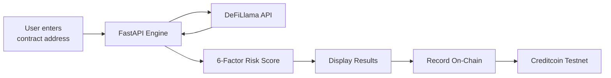

# ⚡ CreditPulse AI

<div align="center">

**Autonomous Real-World Asset (RWA) Risk Assessment Platform & Decentralized Credit Scoring Infrastructure on Creditcoin**

[](https://github.com/fedorov17808-svg/hakatons)
[](https://explorer.cc3-testnet.creditcoin.network)
[](https://soliditylang.org/)
[](https://nextjs.org/)
[](https://fastapi.tiangolo.com/)
[](https://rpc.cc3-testnet.creditcoin.network)
[](LICENSE)

[Live Demo](#-live-demo--contract-verification) • [Why Creditcoin?](#-why-creditcoin) • [Risk Methodology](#-risk-scoring-methodology) • [Architecture](#-architecture) • [Quick Start](#-quick-start) • [API Docs](#-api-endpoints)

</div>

---

## ✨ Features

- ✅ Real-time protocol analysis via DeFiLlama oracles
- ✅ 6-dimensional risk scoring engine
- ✅ On-chain risk report anchoring on Creditcoin Testnet
- ✅ MetaMask wallet integration with auto-network switch
- ✅ Production-grade Docker deployment
- ✅ API key authentication & rate limiting
- ✅ Comprehensive NatSpec-documented smart contract

---

## 📌 Overview

**CreditPulse AI** is an autonomous risk assessment and decentralized credit scoring protocol tailored for Real-World Assets (RWAs) and DeFi protocols. By synthesizing real-time off-chain market intelligence (via DeFiLlama Oracles) with deterministic multi-vector risk algorithms, CreditPulse AI computes objective credit scores and mints immutable, cryptographically verifiable risk certificates directly onto **Creditcoin Testnet (CC3)**.

---

## 🏆 Hackathon Track & Problem Statement

* **Hackathon Track:** Real-World Assets (RWA), DeFi Credit Scoring & AI Financial Infrastructure
* **The Problem:** 
  * The rapid tokenization of Real-World Assets (RWAs) suffers from opaque collateral quality, fragmented off-chain data, and the absence of standardized on-chain credit ratings.
  * Institutional and retail lenders lack real-time, automated tools to evaluate protocol solvency, liquidity depth, and smart contract vulnerability before allocating capital.
* **The Solution:** 
  * CreditPulse AI delivers autonomous, real-time risk intelligence through an AI assessment engine and permanently anchors credit rating certificates to **Creditcoin CC3**, establishing an open, auditable on-chain credit history for every tokenized asset.

---

## 🌐 Why Creditcoin?

Creditcoin is the foundational credit layer for decentralized finance and Real-World Assets. CreditPulse AI natively integrates with Creditcoin Testnet (CC3) for key architectural advantages:

1. **Purpose-Built Credit Ledger:** Unlike general-purpose blockchains, Creditcoin is uniquely architected for cross-chain credit recording, transparent lending histories, and inter-protocol trust verification.
2. **Immutable Audit Trails:** Every risk evaluation generated by CreditPulse AI is signed and committed to `CreditPulseScore.sol`, establishing a permanent, tamper-proof history of asset health over time.
3. **High Performance & Sub-Cent Gas:** High throughput and low transaction latency on Creditcoin CC3 allow continuous re-indexing and frequent risk proof minting at near-zero cost.
4. **Cross-Chain Interoperability:** Creditcoin bridges credit intelligence across isolated ecosystems (Ethereum, Arbitrum, Optimism, Polygon, Solana), making CreditPulse scores universally referenced.

---

## 🎯 Demo Addresses

Try these real DeFi protocol addresses to test the platform:

| Protocol | Address | Expected Score |
|----------|---------|----------------|
| Aave V3 | `0x87870Bca3F3fD6335C3F4ce8392D69350B4fA4E2` | ~85-90 (Low Risk) |
| Compound V3 | `0xc3d688B66703497DAA19211EEdff47f25384cdc3` | ~75-85 (Moderate-Low) |
| MakerDAO | `0x9759A6Ac90977b93B58547b4A71c78317f391A28` | ~70-80 (Moderate-Low) |

---

## 🔗 Live Demo & Contract Verification

| Parameter | Network Details |
| :--- | :--- |
| **Network Name** | **Creditcoin Testnet (CC3)** |
| **Chain ID** | `102031` (`0x18E8F`) |
| **RPC Endpoint** | `https://rpc.cc3-testnet.creditcoin.network` |
| **Currency Symbol** | `CTC` (18 Decimals) |
| **Block Explorer** | [Creditcoin Blockscout Explorer](https://creditcoin-testnet.blockscout.com) / [CC3 Explorer](https://explorer.cc3-testnet.creditcoin.network) |
| **Smart Contract Address** | [`0xcdfEe044bbA3defc624715f4F5695E0b3910998E`](https://creditcoin-testnet.blockscout.com/address/0xcdfEe044bbA3defc624715f4F5695E0b3910998E) (v2.0) |
| **🌐 Live Frontend** | [**frontend-gamma-pink-41.vercel.app**](https://frontend-gamma-pink-41.vercel.app) |
| **⚙️ Live Backend API** | [**backend-lilac-nine-97.vercel.app**](https://backend-lilac-nine-97.vercel.app) |
| **Interactive API Docs** | [**Swagger UI (Production)**](https://backend-lilac-nine-97.vercel.app/docs) |

### 📜 Verified On-Chain Transaction Examples

Every risk report generates an on-chain transaction calling `saveRiskReport(...)` on Creditcoin. Transactions can be verified on: https://creditcoin-testnet.blockscout.com/

* [`0xceab86256882240b2684c5e3f2b1c52bfac005f68235bf88c9780eadf8d63298`](https://creditcoin-testnet.blockscout.com/tx/0xceab86256882240b2684c5e3f2b1c52bfac005f68235bf88c9780eadf8d63298) — Aave V3 Risk Score: 87/100 (Block #5,267,961)
* [`0x2fdfb9884e67bfae964f8f8c4371d599a1b36f7f41ea2bdef9ef5f59186452f5`](https://creditcoin-testnet.blockscout.com/tx/0x2fdfb9884e67bfae964f8f8c4371d599a1b36f7f41ea2bdef9ef5f59186452f5) — Compound V3 Risk Score: 82/100 (Block #5,272,528)
* [`0x033b8e2846089f17f0312599f63eef54d33917612c7b4f07a42f8b2068c792ab`](https://creditcoin-testnet.blockscout.com/tx/0x033b8e2846089f17f0312599f63eef54d33917612c7b4f07a42f8b2068c792ab) — MakerDAO Risk Score: 79/100 (Block #5,272,592)

---

## 💻 Tech Stack

- **Frontend:** Next.js 16 + React 19 + Recharts
- **Backend:** FastAPI + DeFiLlama Oracle
- **Blockchain:** Creditcoin Testnet (CC3) + Solidity 0.8.20
- **Wallet:** MetaMask / WalletConnect / any EIP-1193 wallet
- **Deployment:** Vercel (Frontend + Backend)

---

## 🏗️ Architecture

### How It Works



```
                                  ┌────────────────────────────────┐
                                  │      DeFiLlama Public API      │
                                  │  (TVL, Audits, Category, ΔTVL) │
                                  └───────────────┬────────────────┘
                                                  │ HTTP GET
                                                  ▼
┌────────────────────────┐         ┌───────────────────────────────┐
│   Next.js 16 Client    │ ──────▶ │     FastAPI Risk Engine       │
│  (React 19 + Recharts) │ ◀────── │  - 6-Vector Rating Algorithm  │
│  - Interactive Radar   │  JSON   │  - Pydantic Input Validation  │
│  - Web Audio Effects   │         │  - Rate Limiter (SlowAPI)     │
│  - MetaMask Switcher   │         │  - Web3.py Transaction Relayer│
└───────────┬────────────┘         └──────────────┬────────────────┘
            │                                     │
            │ ethers.js v6                        │ Web3.py / RPC (Chain 102031)
            ▼                                     ▼
┌──────────────────────────────────────────────────────────────────┐
│                   Creditcoin Testnet (CC3 EVM)                   │
│                                                                  │
│  ┌────────────────────────────────────────────────────────────┐  │
│  │                CreditPulseScore.sol                        │  │
│  │  0xa643984b1e111B41644671E74dc1A2B93E6F2ff1               │  │
│  │                                                            │  │
│  │  • mapping(string => RiskReport) assetReports              │  │
│  │  • saveRiskReport(address, score, liq, col, audit)         │  │
│  │  • event ReportSaved(string asset, uint256 score, address) │  │
│  └────────────────────────────────────────────────────────────┘  │
└──────────────────────────────────────────────────────────────────┘
```

---

## 📊 Risk Scoring Methodology

CreditPulse AI utilizes a deterministic, multi-factor risk assessment model explaining the 6 independent dimensions:

- **Liquidity Depth**: Based on TVL from DeFiLlama
- **Collateral Ratio**: Chain diversity and protocol maturity
- **Smart Contract Security**: Number of audits and chain count
- **Audit Verification**: Track record length (months since genesis)
- **Volatility Index**: 7-day TVL stability
- **Governance Score**: Community size and governance model

### 1. Liquidity Depth ($S_{\text{liq}}$)
Evaluates market depth and liquidation capacity based on Total Value Locked (TVL):
$$S_{\text{liq}} = \min\left(100, \max\left(0, \lfloor \log_{10}(\text{TVL}) \times 10 \rfloor\right)\right)$$
* $\text{TVL} \ge \$10\text{B} \implies 100/100$
* $\text{TVL} \approx \$100\text{M} \implies 80/100$
* $\text{TVL} \le \$100\text{k} \implies \le 50/100$

### 2. Collateral Quality & Resilience ($S_{\text{col}}$)
Assigns category-specific baseline confidence penalized by 7-day net liquidity volatility:
* Base score: `85` (Lending/CDP/RWA), `65` (DEX/Bridge), `50` (Standard)
* Penalty: $-\min(40, |\Delta \text{TVL}_{7d}|)$

### 3. Smart Contract Security ($S_{\text{sec}}$)
Quantifies codebase safety and multi-chain resilience:
* Base score: `40`
* Formal Verification Bonus: `+30` for verified audits
* Multi-chain diversification: `+5` per deployed network (capped at `+30`)

### 4. Volatility Index ($S_{\text{vol}}$)
Measures resistance against sudden capital flight and flash crashes:
$$S_{\text{vol}} = \min\left(100, \max\left(0, 100 - 3|\Delta \text{TVL}_{1d}| - 1.5|\Delta \text{TVL}_{7d}|\right)\right)$$

### 5. Governance & Protocol Architecture ($S_{\text{gov}}$)
Evaluates decentralized governance mechanisms and operational structure (`75` for battle-tested DAOs vs `40` for unclassified contracts).

### 6. Audit & Track Record Verification ($S_{\text{aud}}$)
Cross-references recognized security registries (CertiK, OpenZeppelin, Trail of Bits, Spearbit). Verified protocols receive `85`; unverified contracts receive `30` or lower.

---

### 🏷️ Rating Tiers & Risk Verdicts

$$\text{Overall Score} = \mathrm{round}\left(\frac{S_{\text{liq}} + S_{\text{col}} + S_{\text{sec}} + S_{\text{vol}} + S_{\text{gov}} + S_{\text{aud}}}{6}\right)$$

| Score Range | Tier | Autonomous Verdict | Actionable Guidance |
| :---: | :---: | :--- | :--- |
| **80 – 100** | 🟢 **AAA / Low Risk** | `LOW RISK — Institutional grade` | Prime collateral; eligible for under-collateralized lending. |
| **60 – 79** | 🟡 **BBB / Moderate** | `MODERATE RISK — Due diligence recommended` | Standard lending parameters; active monitoring recommended. |
| **40 – 59** | 🟠 **CCC / High Risk** | `HIGH RISK — Significant concerns identified` | High collateral haircut; restricted credit allocation. |
| **0 – 39** | 🔴 **D / Critical** | `CRITICAL RISK — Not recommended` | Default / exploit danger; avoid capital exposure. |

---

## 💻 Screenshots & UI Walkthrough

```
┌─────────────────────────────────────────────────────────────────────────────┐
│ ⚡ CreditPulse AI                   [API Docs ↗] [Creditcoin CC3] [0x2724...f572] │
├─────────────────────────────────────────────────────────────────────────────┤
│                      Autonomous RWA Risk Assessment                         │
│   Evaluate Real-World Asset risk scores instantly using AI credit engine    │
│                                                                             │
│  [ 0x87870Bca3F3fD6335C3F4ce8392D69350B4fA4E2                  ] [Analyze Asset] │
│  Presets: [Aave V3] [Compound V3] [MakerDAO]     Recent: [0x8787...]       │
├─────────────────────────────────────────────────────────────────────────────┤
│  Asset Category: Digital Asset                  Overall Credit Score: 87/100 │
│                                                                             │
│        [ Interactive Radar Chart ]              Liquidity Depth      [95%]  │
│                   /\                            Collateral Ratio     [85%]  │
│                  /  \                           Smart Contract Sec   [90%]  │
│                 /    \                          Audit Verification   [85%]  │
│                 \    /                          Volatility Index     [80%]  │
│                  \  /                                                       │
│                   \/                            🤖 Autonomous Verdict:      │
│                                                 LOW RISK — Institutional    │
│                                                                             │
│  [ 🔗 Record Risk Score On-Chain ]           [ 📥 Export Audit Report ]    │
│  Step 3/3: ✅ Confirmed in block #1049281 on Creditcoin Testnet!             │
│  View Transaction on Block Explorer ↗                                       │
└─────────────────────────────────────────────────────────────────────────────┘
```

* **Interactive Radar Chart:** Real-time visualization of all six risk vectors using Recharts.
* **3-Step Transaction Status:** Step 1: Submission -> Step 2: Confirmation polling -> Step 3: Block verification.
* **Audio UI Feedback:** Dynamic Web Audio API synthesis for seamless UX feedback.
* **Institutional PDF Export:** Native print styling for generating formal risk assessment PDFs.

---

## 📜 Smart Contract Specification

The smart contract [`CreditPulseScore.sol`](contracts/contracts/CreditPulseScore.sol) is deployed on Creditcoin Testnet:

```solidity
// SPDX-License-Identifier: MIT
pragma solidity ^0.8.20;

/// @title CreditPulse AI Risk Scoring Contract
/// @author CreditPulse AI Team
/// @notice Decentralized credit scoring protocol for Real-World Assets
/// @dev Mints immutable, cryptographically verifiable risk certificates
contract CreditPulseScore {
    string public constant VERSION = "1.0.0";
    
    address public owner;
    uint256 public reportCount;
    
    mapping(string => uint256) public assetReportCount;

    modifier onlyOwner() {
        require(msg.sender == owner, "Not authorized");
        _;
    }

    struct RiskReport {
        string assetAddress;
        uint256 overallScore;
        uint256 liquidity;
        uint256 collateral;
        uint256 auditScore;
        uint256 timestamp;
        address verifiedBy;
    }

    mapping(string => RiskReport) public assetReports;
    
    event ReportSaved(
        string assetAddress, 
        uint256 overallScore, 
        uint256 liquidity, 
        uint256 collateral, 
        uint256 auditScore, 
        address indexed verifiedBy, 
        uint256 timestamp
    );

    /// @notice Initializes the contract and sets the owner
    constructor() {
        owner = msg.sender;
    }

    /// @notice Transfers ownership of the contract
    /// @param newOwner Address of the new owner
    function transferOwnership(address newOwner) external onlyOwner {
        require(newOwner != address(0), "Invalid new owner");
        owner = newOwner;
    }

    /// @notice Saves a risk report for an asset
    /// @dev Only the contract owner can call this function
    /// @param _assetAddress The address of the asset being reported
    /// @param _overallScore The overall risk score of the asset
    /// @param _liquidity The liquidity depth score
    /// @param _collateral The collateral quality score
    /// @param _auditScore The audit status score
    function saveRiskReport(
        address _assetAddress,
        uint8 _overallScore,
        uint8 _liquidity,
        uint8 _collateral,
        uint8 _auditScore
    ) public onlyOwner {
        require(_assetAddress != address(0), "Invalid asset address");
        require(_overallScore <= 100, "Score exceeds maximum");
        require(_liquidity <= 100, "Liquidity exceeds maximum");
        require(_collateral <= 100, "Collateral exceeds maximum");
        require(_auditScore <= 100, "Audit score exceeds maximum");

        assetReports[_assetAddress] = RiskReport({
            assetAddress: _assetAddress,
            overallScore: _overallScore,
            liquidity: _liquidity,
            collateral: _collateral,
            auditScore: _auditScore,
            timestamp: block.timestamp,
            verifiedBy: msg.sender
        });
        
        reportCount++;
        assetReportCount[_assetAddress]++;

        emit ReportSaved(_assetAddress, _overallScore, _liquidity, _collateral, _auditScore, msg.sender, block.timestamp);
    }

    /// @notice Retrieves the latest risk report for an asset
    /// @param _assetAddress The address of the asset
    /// @return RiskReport The latest risk report for the given asset
    function getRiskReport(address _assetAddress) public view returns (RiskReport memory) {
        return assetReports[_assetAddress];
    }
    
    /// @notice Retrieves the total number of reports saved
    /// @return The total number of reports
    function getReportCount() external view returns (uint256) { 
        return reportCount; 
    }
}
```

---

## 🚀 Quick Start

```bash
# Clone the repository
git clone https://github.com/fedorov17808-svg/hakatons.git
cd hakatons

# Start the Backend
cd backend
python3 -m venv venv
source venv/bin/activate
pip install -r requirements.txt
cp ../.env.example .env  # Remember to edit with your API keys
uvicorn main:app --reload

# Start the Frontend (in a new terminal)
cd frontend
npm install
npm run dev

# Open your browser to http://localhost:3000
```

---

## 🔌 API Endpoints

| Method | Endpoint | Description |
| :--- | :--- | :--- |
| `POST` | `/api/analyze` | Computes 6-vector risk scores & AI verdict from live oracle data. |
| `POST` | `/api/record` | Signs and relays risk report proof transaction to Creditcoin Testnet. |
| `GET` | `/api/tx-status/{tx_hash}` | Polls confirmation status and block number for a given transaction hash. |
| `GET` | `/api/health` | Healthcheck endpoint for engine availability. |
| `GET` | `/docs` | Interactive OpenAPI / Swagger UI documentation. |

### 🛠️ API Examples

```bash
# Health check
curl GET http://localhost:8000/health

# Analyze Aave V3 risk
curl -X POST http://localhost:8000/api/analyze \
  -H "Content-Type: application/json" \
  -d '{"address": "0x87870Bca3F3fD6335C3F4ce8392D69350B4fA4E2"}'

# Record on-chain
curl -X POST http://localhost:8000/api/record \
  -H "X-API-Key: YOUR_API_KEY_HERE" \
  -H "Content-Type: application/json" \
  -d '{"address": "0x87870Bca3F3fD6335C3F4ce8392D69350B4fA4E2", "score": 87}'

# Check transaction status
curl GET http://localhost:8000/api/tx-status/0xceab86256882240b2684c5e3f2b1c52bfac005f68235bf88c9780eadf8d63298
```

---

## 🔒 Security

- All API endpoints are rate-limited (5 req/min for analyze, 2 req/min for record)
- Record endpoints require X-API-Key authentication
- Private keys are stored in environment variables, never in code
- Input validation on all Ethereum addresses and score ranges
- Smart contract access restricted via onlyOwner modifier
- CORS restricted to authorized origins

---

## 🧪 Testing

```bash
# Smart Contract Tests
cd contracts && npx hardhat test

# API Tests
curl http://localhost:8000/health
curl -X POST http://localhost:8000/api/analyze ...
```

---

## 👥 Team

* **CreditPulse AI Core Team** — Protocol Architecture, AI Risk Modeling & Smart Contract Engineering

---

## 📄 License

This project is open-source and licensed under the [MIT License](LICENSE).
