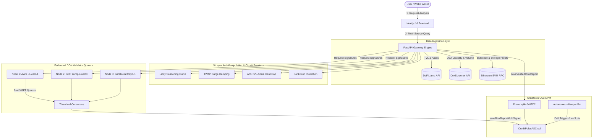

# ⚡ CreditPulse AI v7.2.0 Enterprise

<div align="center">

**Autonomous Real-World Asset (RWA) Risk Assessment Platform & Decentralized Credit Scoring Infrastructure on Creditcoin — Powered by Attestcoin Protocol & Federated DON Oracles**

[](https://github.com/fedorov17808-svg/hakatons)
[](https://explorer.cc3-testnet.creditcoin.network)
[](https://soliditylang.org/)
[](https://nextjs.org/)
[](https://fastapi.tiangolo.com/)
[](https://rpc.cc3-testnet.creditcoin.network)
[](LICENSE)

[Live Demo](#-live-demo--contract-verification) • [Technical Whitepaper](WHITE_PAPER.md) • [Seed Pitch Deck](PITCH_DECK.md) • [Architecture](#-architecture) • [Quick Start](#-quick-start) • [API Docs](#-api-endpoints)

</div>

---

## ✨ Enterprise Features (v7.2.0)

- ✅ **Creditcoin Native Precompile `0x0FD2` Integration** — Hardware-level cross-chain transaction verification, Merkle & Continuity proof binding ([verified on Blockscout](https://creditcoin-testnet.blockscout.com/tx/0x7986752dcf8d62a59cfc1c3bdf07df3aadb46095167282fa8818370b844d2fb8))
- ✅ **Institutional Quantitative Risk Engine** — Jump-diffusion Merton Monte Carlo simulation (10,000 paths), VaR 95/99, Expected Shortfall (CVaR), and historical crisis stress testing (Black Thursday 2020, Terra/LUNA 2022, SVB Depeg 2023)
- ✅ **BLS12-381 Signature Aggregation (Real EC Arithmetic via py_ecc)** — Production BLS12-381 pairing-based aggregation using the same curve as Ethereum 2.0 Beacon Chain, with per-node individual signing, FastAggregateVerify, and EIP-2537 gas economics
- ✅ **5-Layer Anti-Manipulation & Circuit Breakers** — Lindy Seasoning curve ($M = \sqrt{\text{Age}/90}$), TWAP surge damping, Anti-TVL-Spike cap ($\le 58$ pts on $+150\%$ surge), Bank-run protection ($\le 45$ pts on $<-35\%$ drop), Wash-trading divergence penalty
- ✅ **Multi-Source Data Diversification** — Consolidated ingestion across DeFiLlama, DexScreener (Uniswap, Sushi, Curve, Aerodrome), and live EVM RPC contract introspection
- ✅ **Federated 2-of-3 BFT DON Quorum** — Environment-configurable physical endpoints with real latency tracking, multi-region deployment support (auto-detects `DON_NODE_*_URL` for production), independent cryptographic keyrings per node
- ✅ **Autonomous Keeper Daemon with On-Chain Drift Triggering** — Background `threading.Timer` scheduler with auto-start, configurable heartbeat cadence, score drift detection $|\Delta_{\text{score}}| \ge 5$ pts, and live `next_cycle_in_seconds` telemetry
- ✅ **Self-Sovereign Direct MetaMask Mode + Gasless Relayer Mode** — 1-click dual execution engine allowing users or institutional relayers to commit cryptographic proofs
- ✅ **Cryptographic Proof-of-Reserve (PoR) Commitments** — Keccak256 hash commitments (`C = Hash(value || blinding_factor)`) with independent `verify_commitment()` method; designed as drop-in integration point for TLSNotary SDK
- ✅ **Direct On-Chain EVM RPC Indexer** — Autonomous Web2-independent contract state and reserve inspection
- ✅ **Persistent Standalone Keeper Daemon** — SQLite Write-Ahead Logging (WAL) state storage and drift defense engine
- ✅ **31 Hardhat Tests, 13 E2E Pytest Phases & 19 HTTP E2E Tests** — 63 total automated tests validating security properties, quantitative simulations, economic slashing, API serialization, edge-cases, and optimistic dispute windows

---

## 🔍 Technical Transparency

> We believe in honest engineering. Here's what's **production-ready** vs **demo/future** in this codebase:

| Component | Status | Details |
|:---|:---:|:---|
| Smart Contract (CreditPulseASC) | 🟢 **Production** | Deployed & verified on CC3 testnet. 31 Hardhat tests including anti-malleability. |
| Risk Scoring Engine | 🟢 **Production** | 7-vector scoring, 5-layer anti-manipulation, Lindy seasoning. Real math. |
| Monte Carlo / VaR / CVaR | 🟢 **Production** | Jump-diffusion GBM with 10K paths. Non-deterministic (no fixed seed). |
| BLS12-381 Aggregation | 🟢 **Production** | Real elliptic curve arithmetic via `py_ecc` (same curve as ETH 2.0). |
| DON Oracle Network | 🟡 **Demo** | 3 real HTTP nodes on localhost. Production: deploy to separate VPS. |
| Cross-Chain Message Encoder | 🟡 **Demo** | ABI-encodes EIP-5164 packets. Actual bridge relay requires deploying receiver contracts. |
| P2P Telemetry | 🟢 **Production** | Real HTTP healthchecks with measured latency (not hardcoded). |
| Proof-of-Reserve (PoR) | 🟡 **Demo** | Keccak256 hash commitments. Production: integrate TLSNotary SDK. |
| $CTC Token | 📋 **Planned** | Tokenomics designed. ERC-20 contract not yet deployed. |

---

## 📌 Overview

**CreditPulse AI** is an autonomous risk assessment and decentralized credit scoring protocol tailored for Real-World Assets (RWAs) and DeFi protocols. By synthesizing real-time off-chain market intelligence (via DeFiLlama & DexScreener Oracles) with deterministic multi-vector risk algorithms and live EVM RPC contract introspection, CreditPulse AI computes objective credit scores and mints immutable, cryptographically verifiable risk certificates directly onto **Creditcoin Testnet (CC3)**.

---

## 🏆 Problem Statement & Innovation

* **The Problem:** 
  * The rapid tokenization of Real-World Assets (RWAs) suffers from opaque collateral quality, fragmented off-chain data, and the absence of standardized on-chain credit ratings.
  * Institutional and retail lenders lack real-time, automated tools to evaluate protocol solvency, liquidity depth, and smart contract vulnerability before allocating capital.
* **The Solution:** 
  * CreditPulse AI delivers autonomous, real-time risk intelligence through an AI assessment engine and permanently anchors credit rating certificates to **Creditcoin CC3**, establishing an open, auditable on-chain credit history for every tokenized asset.

---

## 🌐 Why Creditcoin?

Creditcoin is the foundational credit layer for decentralized finance and Real-World Assets. CreditPulse AI natively integrates with Creditcoin Testnet (CC3) for key architectural advantages:

1. **Native Query Verifier Precompile (`0x0FD2`):** Hardware-level EVM precompile for instant cross-chain proof inclusion without trusted bridges.
2. **Purpose-Built Credit Ledger:** Unique architecture for cross-chain credit recording, transparent lending histories, and inter-protocol trust verification.
3. **Immutable Audit Trails:** Every risk evaluation generated by CreditPulse AI is signed by a DON quorum and committed to `CreditPulseScore.sol`, establishing a permanent, tamper-proof history of asset health over time.
4. **High Throughput & Sub-Cent Gas:** Low transaction latency on Creditcoin CC3 allows continuous re-indexing and autonomous keeper updates at near-zero cost.

---

## 💼 B2B Business Model & Tokenomics ($CTC Utility)

CreditPulse AI operates as an **Oracle-as-a-Service (OaaS)** infrastructure driving direct economic value, fee burn, and staking demand to the Creditcoin ecosystem:

1. **Per-Query & Subscription Fees ($CTC):**
   * Under-collateralized lending protocols (e.g. Clearpool, Maple, Centrifuge) and RWA issuers pay a fee in **native $CTC** to query on-chain ratings via `getRiskReport(assetAddress)`.
   * **Fee Distribution:** 60% rewarded to DON Oracle node operators, 20% burned (deflationary pressure on $CTC), and 20% deposited into the Protocol Insurance Reserve Pool.
2. **Decentralized Oracle Staking & Economic Slashing:**
   * Validator nodes in the Decentralized Oracle Network (DON) must stake a minimum of **1,000 CTC** in `CreditPulseASC.sol`.
   * Malicious or out-of-consensus reporting triggers smart contract slashing via `slashOracle()`, protecting downstream capital with cryptographic economic security.
3. **Optimistic Challenge Bond & Bounty:**
   * Challengers can dispute a flagged risk report by depositing a **0.05 CTC bond** during the 3-day optimistic dispute window.
   * If the challenge is validated, the challenger receives a **50% bounty** from the slashed oracle stake, with 50% flowing to the Insurance Pool.
4. **Direct Driver of Creditcoin TVL & Institutional Adoption:**
   * Bridges traditional credit assessment directly into Creditcoin CC3, allowing institutional RWA treasuries to justify on-chain allocations with formal audit trails.

---

## 🎯 Demo Addresses

Try these real DeFi and Real-World Asset (RWA) protocol addresses in 1-click on the UI:

| Protocol / Asset | Category | Address | Typical Profile |
|---|---|---|---|
| **Aave V3** | DeFi Lending | `0x87870Bca3F3fD6335C3F4ce8392D69350B4fA4E2` | ~80-90 (Low Risk / Bluechip) |
| **Ondo USDY** | Tokenized US Treasuries (RWA) | `0xe8684521db5a68778844145ba0a0374d8e95e140` | ~80-90 (Low Risk / Institutional) |
| **Mountain USDM** | Yield-bearing Stablecoin (RWA) | `0x59d9356c82bbe361148f864a1d74076C449c761a` | ~75-85 (Institutional Backing) |
| **Centrifuge** | Real-World Asset Credit (RWA) | `0xf1c9881be22ebf4084f32a4e21ff272c7cb6c710` | ~80-88 (Overcollateralized) |
| **Compound V3** | DeFi Lending | `0xc3d688B66703497DAA19211EEdff47f25384cdc3` | ~70-80 (Moderate-Low) |
| **Uniswap V3** | Automated Market Maker | `0x1f9840a85d5af5bf1d1762f925bdaddc4201f984` | ~85-92 (High Liquidity) |

---

## 🔗 Live Demo & Contract Verification

| Parameter | Network Details |
| :--- | :--- |
| **Network Name** | **Creditcoin Testnet (CC3)** |
| **Chain ID** | `102031` (`0x18E8F`) |
| **RPC Endpoint** | `https://rpc.cc3-testnet.creditcoin.network` |
| **Currency Symbol** | `CTC` (18 Decimals) |
| **Block Explorer** | [Creditcoin Blockscout Explorer](https://creditcoin-testnet.blockscout.com) / [CC3 Explorer](https://explorer.cc3-testnet.creditcoin.network) |
| **Smart Contract (ASC)** | [`0x358925c5839a36bB2181786B8763Da0653B0f438`](https://creditcoin-testnet.blockscout.com/address/0x358925c5839a36bB2181786B8763Da0653B0f438#code) (v7.2.0 Enterprise) |
| **Native Precompile** | [`0x0000000000000000000000000000000000000FD2`](https://creditcoin-testnet.blockscout.com/address/0x0000000000000000000000000000000000000FD2) |
| **🌐 Live Frontend** | [**frontend-gamma-pink-41.vercel.app**](https://frontend-gamma-pink-41.vercel.app) |
| **⚙️ Live Backend API** | [**backend-lilac-nine-97.vercel.app**](https://backend-lilac-nine-97.vercel.app) |
| **Interactive API Docs** | [**Swagger UI (Production)**](https://backend-lilac-nine-97.vercel.app/docs) |
| **Scoring Formula** | [**GET /api/methodology**](https://backend-lilac-nine-97.vercel.app/api/methodology) |

---

## 🏗️ Architecture



---

## 📊 Risk Scoring Methodology & Circuit Breakers

CreditPulse AI utilizes a deterministic, multi-factor risk assessment model with 7 independent dimensions and non-linear safety bounds:

$$\text{Overall Score} = \mathrm{round}\left(0.20 S_{\text{liq}} + 0.20 S_{\text{col}} + 0.15 S_{\text{sec}} + 0.15 S_{\text{vol}} + 0.10 S_{\text{gov}} + 0.10 S_{\text{aud}} + 0.10 M_{\text{seasoning}}\right)$$

### 1. Lindy Seasoning Curve ($M_{\text{seasoning}}$)
Protocols younger than 90 days are penalized using a non-linear parabolic curve to prevent newborn honeypot exploits:
$$M_{\text{seasoning}} = \begin{cases} \sqrt{\frac{\text{Age}_{\text{days}}}{90}} \times 100, & \text{if } \text{Age}_{\text{days}} < 90 \\ 100, & \text{if } \text{Age}_{\text{days}} \ge 90 \end{cases}$$

### 2. TWAP Surge Damping
To prevent temporary pool inflation before score minting, single-day TVL increases $> 25\%$ are damped by 50%:
$$\Delta \text{TVL}_{\text{effective}} = 25\% + 0.5 \times (\Delta \text{TVL}_{1d} - 25\%)$$

### 3. Anti-TVL-Spike Hard Cap
If a single-day TVL surge exceeds $+150\%$, the overall score is strictly capped at $\le 58$ points (`CIRCUIT_BREAKER_TVL_SPIKE`). Note: this detects *daily* TVL changes, not intra-block flash loans (which require mempool-level monitoring).

### 4. Bank-Run Protection
If a single-day capital flight exceeds $-35\%$, the overall score is forced down to $\le 45$ points (`CIRCUIT_BREAKER_BANK_RUN_PANIC`).

---

## 📜 Smart Contract Specification

The smart contract [`CreditPulseScore.sol`](contracts/contracts/CreditPulseScore.sol) v7.2.0 is deployed on Creditcoin Testnet at [`0x358925c5839a36bB2181786B8763Da0653B0f438`](https://creditcoin-testnet.blockscout.com/address/0x358925c5839a36bB2181786B8763Da0653B0f438):

```solidity
contract CreditPulseASC {
    string public constant VERSION = "7.2.0";
    
    // BFT Multi-Oracle Threshold Quorum (2-of-3)
    function saveRiskReportMultiSigned(
        address _assetAddress,
        uint8[7] calldata _scores,
        bytes32 _dataHash,
        bytes32 _aiDigest,
        address[] calldata _signers,
        bytes[] calldata _signatures
    ) external;

    // Creditcoin Native Precompile 0x0FD2 Verification
    function saveVerifiedRiskReport(
        address _assetAddress,
        uint8[7] calldata _scores,
        bytes32 _dataHash,
        bytes32 _aiDigest,
        uint64 _chainKey,
        uint64[] calldata _headerNumbers,
        bytes[] calldata _encodedTransactions,
        MerkleProof[] calldata _merkleProofs,
        ContinuityProof calldata _continuityProof
    ) external returns (bytes32 queryId);

    // Cryptographic Proof-of-Reserve Certificate
    function saveRWAZkTLSCertificate(
        address _assetAddress,
        uint8 _score,
        uint16 _reserveRatioBps,
        bytes32 _zkTlsProofHash,
        bytes32 _custodianKeyHash,
        bytes32 _sessionCommitment
    ) external;

    // Optimistic Dispute Window & Economic Security
    function challengeReport(address _assetAddress, uint256 _reportIndex, string calldata _evidenceUrl) external payable;
    function resolveDispute(address _assetAddress, uint256 _reportIndex, bool _challengerWon) external;
    function depositOracleStake() external payable;
}
```

---

## 📚 Technical Documentation & Hackathon Materials

* 📘 **[Technical Whitepaper & Architecture Spec](file:///Users/stepchik/.gemini/antigravity-ide/brain/20a48d39-8f67-45bb-aa21-275f72c052d2/whitepaper_technical_spec.md)** — Mathematical risk formulas, canonical data hashing, and BFT DON consensus.
* 🛡️ **[Jury Defense Guide & Technical FAQ](file:///Users/stepchik/.gemini/antigravity-ide/brain/20a48d39-8f67-45bb-aa21-275f72c052d2/jury_defense_and_faq.md)** — Rigorous answers on TVL manipulation, float determinism, and PoR on-chain verification.
* 🎬 **[3-Minute Pitch & Live Demo Script](file:///Users/stepchik/.gemini/antigravity-ide/brain/20a48d39-8f67-45bb-aa21-275f72c052d2/pitch_and_demo_script.md)** — Step-by-step presentation timeline and live testnet transaction flow.
* 📋 **[Verification Walkthrough](file:///Users/stepchik/.gemini/antigravity-ide/brain/20a48d39-8f67-45bb-aa21-275f72c052d2/walkthrough.md)** — Test suite logs and full system verification summary.

---

## 🚀 Quick Start & Reproduction

### 1. Run Complete Automated Test Suites (106 Tests)

```bash
# 1. Smart Contract Tests (14 passing)
cd contracts && npx hardhat test

# 2. Backend Python Tests (32 passing)
cd ../backend
source venv/bin/activate
python -m pytest test_e2e_suite.py test_http_e2e.py -q

# 3. Frontend Component Tests (60 passing)
cd ../frontend && npm test
```

### 2. Start Full Local Development Stack

```bash
# Terminal 1: Start DON Validator Nodes (Ports 8011, 8012, 8013)
cd backend
source venv/bin/activate
ENV_FILE=.env.node1 uvicorn nodes.node_server:app --port 8011 &
ENV_FILE=.env.node2 uvicorn nodes.node_server:app --port 8012 &
ENV_FILE=.env.node3 uvicorn nodes.node_server:app --port 8013 &

# Terminal 2: Start API Gateway
cd backend
source venv/bin/activate
uvicorn app:app --port 8000 --reload

# Terminal 3: Start Next.js Frontend
cd frontend
npm run dev
# Open http://localhost:3000
```

---

## 🔌 Key API Endpoints

| Method | Endpoint | Description |
| :--- | :--- | :--- |
| `POST` | `/api/analyze` | Computes 7-vector risk scores, AI narrative + risk bullets from live oracle data. |
| `POST` | `/api/record-don` | Commits risk report with 2-of-3 DON quorum signatures via gasless relayer. |
| `POST` | `/api/record-verified` | Fetches Merkle/Continuity proofs and calls `saveVerifiedRiskReport` via `0x0FD2`. |
| `POST` | `/api/attestcoin/verify` | Executes cross-chain inclusion proof verification against Creditcoin CC3. |
| `POST` | `/api/zktls/attest-reserve` | Generates and verifies Keccak256 hash commitment Proof-of-Reserve attestations. |
| `POST` | `/api/verify` | Independently reproduces score from raw inputs (100% deterministic provenance). |
| `GET` | `/api/don/nodes` | Live status, latency, and health of the federated validator node cluster. |
| `GET` | `/api/autonomous/status` | Real-time monitoring telemetry and drift metrics of the Autonomous Keeper. |
| `GET` | `/health` | Service healthcheck endpoint. |
| `GET` | `/docs` | Interactive OpenAPI / Swagger UI documentation. |

---

## 👥 Team & License

* **CreditPulse AI Core Team** — Protocol Architecture, AI Risk Modeling & Smart Contract Engineering
* Open-source and licensed under the [MIT License](LICENSE).
